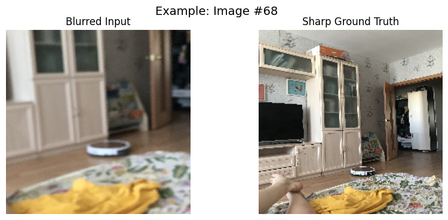
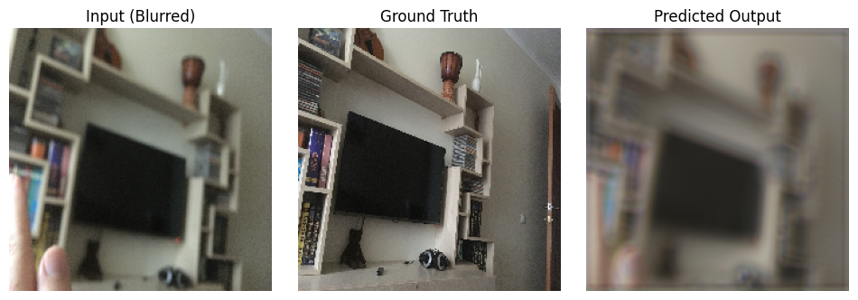
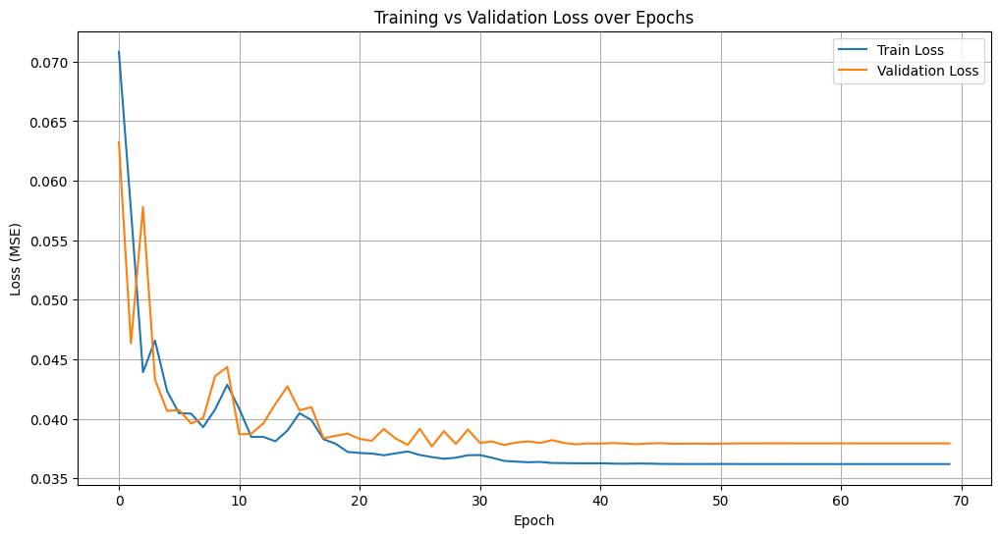
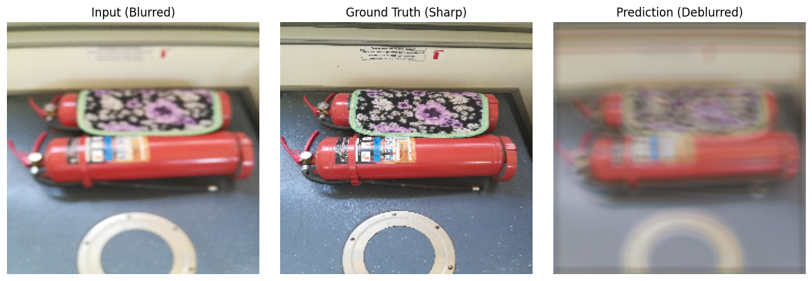

# CNN-Based Image Deblurring using Defocused Blur Dataset

## 1. Title & Abstract

### Title:

**CNN-Based Image Deblurring using a Lightweight Autoencoder Architecture**

### Abstract:

Image deblurring is an essential task in computer vision, especially in low-light or mobile-captured scenes where defocus and motion blur are common. In this work, we propose a lightweight convolutional neural network (CNN) architecture based on an autoencoder-like structure to restore sharp images from blurred ones.

The model was trained on the publicly available **Defocused Blur Dataset** from Kaggle, which includes paired blurred and sharp images. Our CNN consists of 3 downsampling Conv2D layers followed by 5 symmetric Conv2DTranspose layers for upsampling. We used **MSE loss**, alongside evaluation metrics such as **PSNR** and **SSIM**, and optimized the model using **Adam optimizer** with dynamic learning rate scheduling via **ReduceLROnPlateau**.

Experiments show progressive improvement across 70 epochs, with validation loss stabilizing around **0.0379**, and PSNR reaching **15.3 dB**. The predicted outputs recover spatial structure reasonably well, though fine textures remain partially smoothed. This architecture provides a baseline for efficient learning-based deblurring with potential for further improvement through deeper layers, residual connections, or perceptual loss.

---

*Keywords – Image Deblurring, Convolutional Neural Network, Autoencoder, Defocus Blur, PSNR, SSIM, TensorFlow, Image Restoration, Deep Learning*

---

## 2. Introduction

### Problem Definition:

Blurry images due to defocus are a common problem in photography and real-time vision systems. While traditional filtering methods have limited success, learning-based methods provide the ability to map complex non-linear transformations between blurred and sharp domains.

### Motivation:

By building an end-to-end deep neural network for deblurring, we aim to create a simple yet functional pipeline for restoring image clarity. The goal is to investigate how much structure can be recovered using a lightweight model that can later be optimized for mobile or embedded platforms.

### Contributions:

- We develop a **7-layer CNN-based autoencoder** for single image deblurring.
- We train on a **paired dataset of blurred and sharp images**.
- Evaluation is done using **PSNR** and **SSIM**, in addition to MSE.
- Learning rate is adapted automatically with **ReduceLROnPlateau**.
- We visualize both qualitative results and training curves.

---

## 3. Dataset

- **Source**: [kwentar/blur-dataset on Kaggle](https://www.kaggle.com/datasets/kwentar/blur-dataset)
- **Content**:
  - `defocused_blurred/` : blurred input images
  - `sharp/` : corresponding sharp ground truth images
- **Image Size**: Resized to `224x224`
- **Split**: 80% training, 10% validation, 10% test
- **Total Pairs Used**: 216

> 
> **Figure 1:** Left: Input (Blurred) | Right: Ground Truth (Sharp)

> 
> **Figure 2:** Input → Ground Truth → Predicted Output

---

## 4. Model Architecture

The architecture is designed as a symmetric CNN autoencoder with LeakyReLU activations and 5 transposed convolutional layers for reconstruction.

### Model Summary:

```
Model: "sequential"
┏━━━━━━━━━━━━━━━━━━━━━━━━━━━━━━━━━┳━━━━━━━━━━━━━━━━━━━━━━━━┳━━━━━━━━━━━━━━━┓
┃ Layer (type)                    ┃ Output Shape           ┃       Param # ┃
┡━━━━━━━━━━━━━━━━━━━━━━━━━━━━━━━━━╇━━━━━━━━━━━━━━━━━━━━━━━━╇━━━━━━━━━━━━━━━┩
│ conv2d (Conv2D)                 │ (None, 224, 224, 64)   │         1,792 │
│ leaky_re_lu (LeakyReLU)         │ (None, 224, 224, 64)   │             0 │
│ conv2d_1 (Conv2D)               │ (None, 224, 224, 128)  │        73,856 │
│ leaky_re_lu_1 (LeakyReLU)       │ (None, 224, 224, 128)  │             0 │
│ conv2d_2 (Conv2D)               │ (None, 224, 224, 256)  │       295,168 │
│ leaky_re_lu_2 (LeakyReLU)       │ (None, 224, 224, 256)  │             0 │
│ conv2d_transpose                │ (None, 224, 224, 256)  │       590,080 │
│ leaky_re_lu_3 (LeakyReLU)       │ (None, 224, 224, 256)  │             0 │
│ conv2d_transpose_1              │ (None, 224, 224, 128)  │       295,040 │
│ leaky_re_lu_4 (LeakyReLU)       │ (None, 224, 224, 128)  │             0 │
│ conv2d_transpose_2              │ (None, 224, 224, 64)   │        73,792 │
│ leaky_re_lu_5 (LeakyReLU)       │ (None, 224, 224, 64)   │             0 │
│ conv2d_transpose_3              │ (None, 224, 224, 32)   │        18,464 │
│ leaky_re_lu_6 (LeakyReLU)       │ (None, 224, 224, 32)   │             0 │
│ conv2d_transpose_4              │ (None, 224, 224, 3)    │           867 │
└─────────────────────────────────┴────────────────────────┴───────────────┘
 Total params: 1,349,059
```

---

## 5. Training Details

| Parameter     | Value                        |
| ------------- | ---------------------------- |
| Epochs        | 70                           |
| Batch Size    | 32                           |
| Loss Function | Mean Squared Error (MSE)     |
| Optimizer     | Adam                         |
| Metrics       | PSNR, SSIM                   |
| Learning Rate | Adaptive (ReduceLROnPlateau) |
| Framework     | TensorFlow 2.x               |
| Hardware      | Google Colab                 |

> 
> **Figure 3:** Training vs Validation Loss

---

## 6. Results & Analysis

### Quantitative Metrics:

- Final Training Loss: \~0.0353
- Final Validation Loss: \~0.0379
- Peak PSNR: \~15.3 dB
- SSIM: \~0.39 (1 - SSIMLoss)

> 

**Figure 4:** Examples of input, ground truth, and model predictions

### Observations:

- The model learns well in the first 20 epochs.
- Learning rate scheduling helped in loss convergence.
- Outputs recover shapes, but fine textures still lack sharpness.
- SSIM stabilized early, suggesting structural recovery is limited by depth.

---

## 7. Conclusion & Future Work

This study presented a lightweight CNN autoencoder for image deblurring, trained on a real-world defocus blur dataset. The model achieves moderate success in recovering image structure with PSNR \~15 dB. While results are encouraging for shallow architectures, limitations remain in recovering texture-level details.

### Future Enhancements:

- Incorporate **perceptual loss** (e.g., VGG-based)
- Use **U-Net or ResNet-style encoders**
- Add **residual connections**
- Fine-tune on **motion-blurred datasets**
- Mobile deployment through **TensorFlow Lite**

---

## 8. Acknowledgements

Special thanks to the creators of the Blur Dataset on Kaggle, and the open-source community supporting TensorFlow and Colab tools.

## 9. References

[1] Kwentar, "Blur Dataset", Kaggle: [https://www.kaggle.com/datasets/kwentar/blur-dataset](https://www.kaggle.com/datasets/kwentar/blur-dataset)

[2] Wang, Zhou, et al. "Image quality assessment: from error visibility to structural similarity." IEEE transactions on image processing 13.4 (2004): 600-612.

[3] Zhao, Hongyi, et al. "Learning a Deep Convolutional Network for Image Super-Resolution." ECCV 2016.

[4] Nah, Seungjun, et al. "Deep multi-scale convolutional neural network for dynamic scene deblurring." CVPR 2017.

**Prepared by:**\
**Abdulrahman Hamdi**
